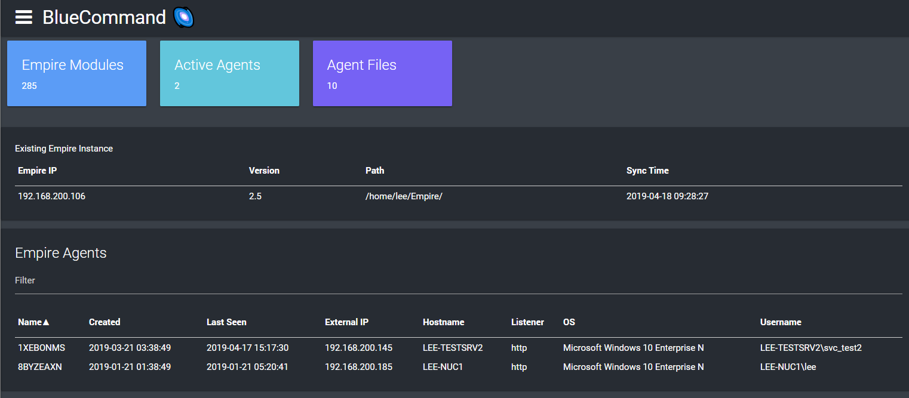
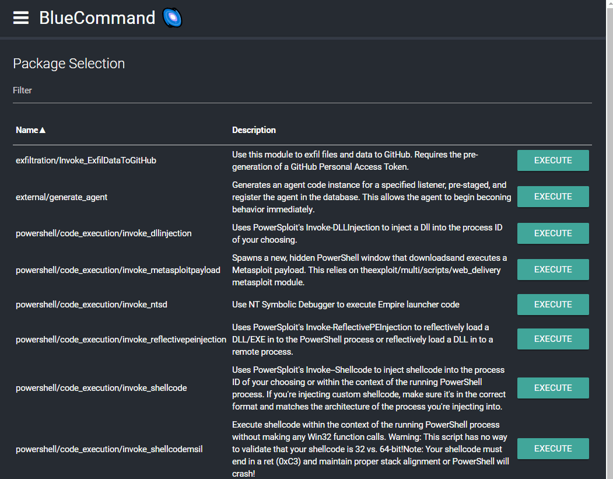
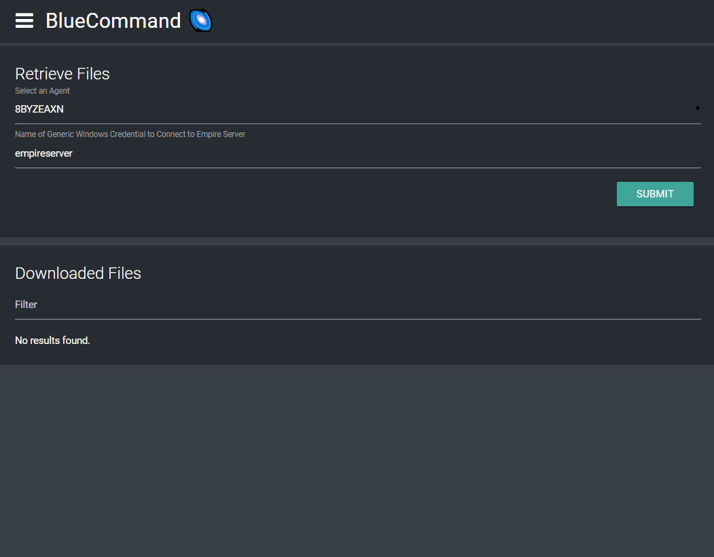

BlueCommand 🌌
==================

**BlueCommand** is a dashboard and tooling front-end for [PowerShell Empire](https://github.com/EmpireProject/Empire) using [PowerShell Universal Dashboard](https://universaldashboard.io/) from [Adam Driscoll](https://github.com/adamdriscoll)

**WARNING**: This project does not nearly scratch the surface of interacting with all the capababilites of PowerShell Empire. This was a project to help my learn / play around with PowerShell Empire and its' REST API. You will be much better served in life but actually learning how to use PowerShell Empire :)

# Features
* Web Dashboard / Controller for PowerShell Empire!
* Utilizes the Empire REST API and [PowerShell Universal Dashboard](https://universaldashboard.io/)
* [PowerShell Empire](https://www.powershellempire.com/) Integration
* Rest Integration to retrieve Empire Instance Information (Agents, Modules Downloads)
* Rest Integration to Execute Modules on Agents.
* SCP to Download Agent Results / Downloads

**Searching and Executing Modules on Empire Agents**

**Retrieving Agent Downloads**

# Getting Started

## Prereqs
1. Install [Universal Dashboard](https://universaldashboard.io/) ``Install-Module UniversalDashboard -AccecptLicense``
2. Install [PoshSSH](https://github.com/darkoperator/Posh-SSH) ``Install-Module -Name Posh-SSH``
   * PoshSSH is used to run SCP commands to extract agent artifacts.
3. Install [PowerShell Credential Manager](https://github.com/davotronic5000/PowerShell_Credential_Manager) ``Install-Module -Name CredentialManager``
   * Credential Manager allows use to easily use Windows Credential Manager to auth to our Empire Server
4. Setup [PowerShell Empire](https://www.powershellempire.com/)
  + Run Empire with --rest command
  + Generate a Listener / Stager
  + Deploy Agents
  + Make a Note of Rest Key and Empire Server IP.

## Usage
1. Populate your environment variables in the ``start.ps1`` Script
2. Run the Start Script
3. Connect to your Empire Server on the Empire Configuration Page using your Empire Server IP, and Rest API Key.
    *  
4.  BlueCommand will try and utilze POSH-SSH to SCP Download the Empire Agents Downloads/Logs - This requires a stored a "Generic Credential" in your windows credential manager to facilitate this.  
