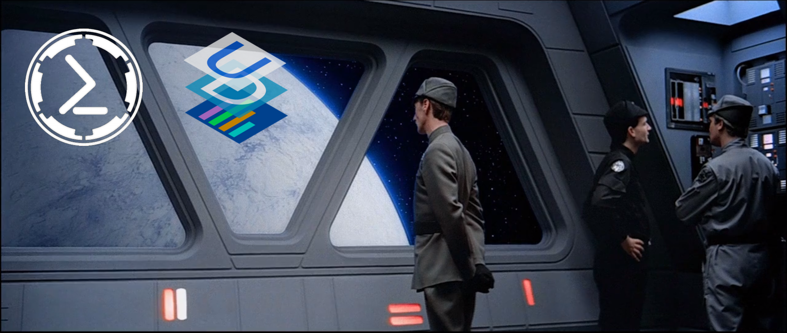

BlueCommand 🌌
==================

**BlueCommand** is a dashboarding and tooling front-end for [PowerShell Empire](https://github.com/EmpireProject/Empire) with the [PowerShell Universal Dashboard](https://universaldashboard.io/) from [Adam Driscoll](https://github.com/adamdriscoll)

## Features
* Built on [Universal Dashboard](https://universaldashboard.io/) for modern web based UI
* [PowerShell Empire](https://www.powershellempire.com/) Integration
    * Rest Integration to retrive Agents, Configs, Modules, Etc.
    * Search and Execute Modules (with Options) on the fly!
    * Export Action Results / Reports from Empire
    * View / Download Agent Files

## Getting Started

### Prereqs
1. Install [Universal Dashboard](https://universaldashboard.io/) ``Install-Module UniversalDashboard -AccecptLicense``
2. Install [PoshSSH](https://github.com/darkoperator/Posh-SSH) ``Install-Module -Name Posh-SSH``
   * PoshSSH is used to run SCP commands to extract agent artifacts.
3. Install [PowerShell Credential Manager](https://github.com/davotronic5000/PowerShell_Credential_Manager) ``Install-Module -Name CredentialManager``
   * Credential Manager allows use to easily use Windows Credential Manager to auth to our Empire Server
4. Setup [PowerShell Empire](https://www.powershellempire.com/)
    + Run Empire with --rest command
    + Generate a Listener / Stager
    + Deploy Agents
    + Make a Note of Rest Key and Empire Server IP.

### Usage
1. Populate your environment variables in the Start Script.
2. Run the Start Script
3. Connect to your Empire Server on the Empire Configuration Page using your Empire Server IP, and Rest API Key.
    *  
4.  BlueCommand will try and utilze POSH-SSH to SCP Download the Empire Agents Downloads/Logs - This requires a stored a "Generic Credential" in your windows credential manager to facilitate this.  
5.  
    
